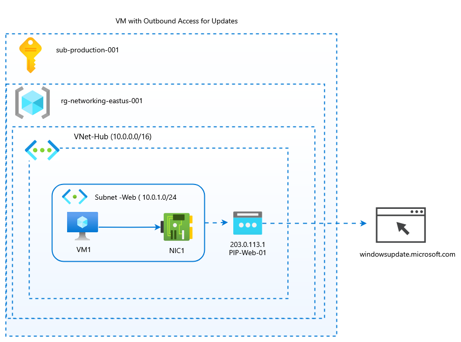

# Azure Cloud Portfolio ☁️ My Azure Cloud Journey! Architecture Diagrams and Solutions

## Lab 01: Private Backend Server
This architecture demonstrates a secure, private backend infrastructure in Azure that connects to a specific domain for updates.

### Resources Used:
* **Virtual Network (VNet)**: Hub Network (10.0.0.0/16)
* **Subnet**: Private Web Subnet (10.0.1.0/24)
* **Compute**: Azure VM with a Standard Public IP service

### Architecture Diagram:

